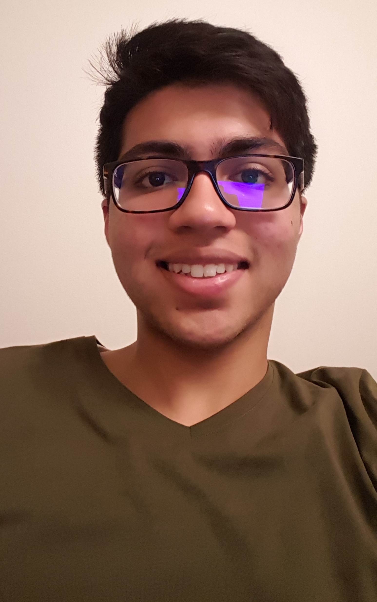

# practice-yousuf-r

I am from Southern Orange County. Apart from living there for most of my life, I also have lived in Saudi Arabia for 4 years. I moved back to the U.S. before the start of high school.
I enjoy playing soccer and swimming. I also am an Eagle Scout, where I enjoyed my time hiking and camping. 
Through the SPIS program, I hope to reduce the uncertaitnites and worries I have towards computer science and I hope to gain a strong foundation in this field!

